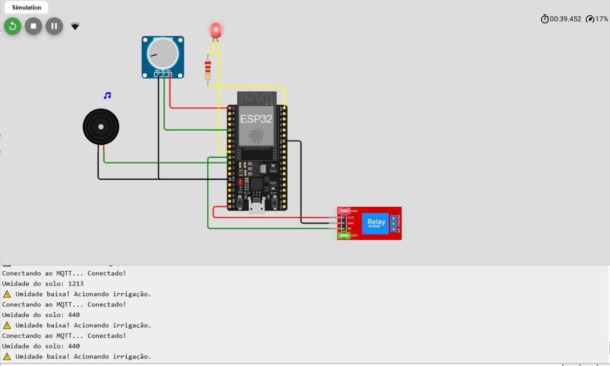

# Sistema Inteligente de Irrigação com ESP32 e MQTT

Este projeto propõe um sistema de irrigação automatizado e sustentável que utiliza a plataforma ESP32, sensores de umidade do solo e comunicação via protocolo MQTT. A proposta visa combater o desperdício de água na agricultura, alinhando-se ao Objetivo de Desenvolvimento Sustentável 6 (ODS 6) da ONU.

## Objetivo

Desenvolver uma solução de irrigação inteligente que:

- Monitore a umidade do solo em tempo real;
- Acione automaticamente a irrigação quando necessário;
- Permita o monitoramento remoto via MQTT;
- Seja validada por meio de simulação no ambiente Wokwi.

---

## 🧰 Componentes Utilizados

| Componente         | Função                            | Pino no ESP32 |
|--------------------|-----------------------------------|----------------|
| ESP32              | Microcontrolador principal        | —              |
| Sensor de Umidade  | Detecta umidade do solo           | GPIO 34        |
| Módulo Relé        | Aciona bomba de irrigação         | GPIO 26        |
| Buzzer             | Emite alertas sonoros             | GPIO 27        |
| LED                | Indica o status do sistema        | GPIO 25        |
| Potenciômetro      | Simula e calibra umidade          | GPIO 32        |
| Resistor 220Ω      | Protege o LED                     | —              |
| Jumpers/Protoboard | Conexões                          | —              |

---

## 🛠️ Ferramentas e Tecnologias

- **ESP32** (Wi-Fi + Bluetooth)
- **Wokwi** (simulação virtual)
- **Lucidchart** (modelagem visual do circuito)
- **Arduino IDE** (linguagem C++)
- **Bibliotecas**: `WiFi.h`, `PubSubClient.h`

---

## ⚙️ Funcionamento do Sistema

1. O ESP32 conecta-se à rede Wi-Fi e ao broker MQTT.
2. O potenciômetro simula a umidade do solo.
3. O sistema compara a leitura com um limite pré-definido.
4. Se a umidade estiver baixa:
   - Aciona o relé (liga bomba de irrigação);
   - Ativa LED e buzzer;
   - Publica os dados no broker MQTT.
5. Caso a umidade esteja adequada:
   - Relé é desativado;
   - Sistema permanece em espera.
6. O ciclo reinicia após um intervalo, garantindo monitoramento contínuo.

---

## 🔄 Diagrama esquemático

! [Diagrama](Imagens/diagrama_circuito.png)

---
## 📸 Imagens da Simulação

### Solo Seco

---

## ▶️ Vídeo Demonstração - Simulação Wokwi

[🔗 Clique aqui para assistir no YouTube](https://studio.youtube.com/video/yaLfNWBHTl4/edit)
[🔗 Clique aqui para simular no Wokwi(https://wokwi.com/projects/431979887661363201).
---

## 🌐 Referências

- ONU ODS 6: https://brasil.un.org/pt-br/sdgs
- Espressif: https://www.espressif.com
- Wokwi: https://wokwi.com/
- Fritzing: https://fritzing.org

